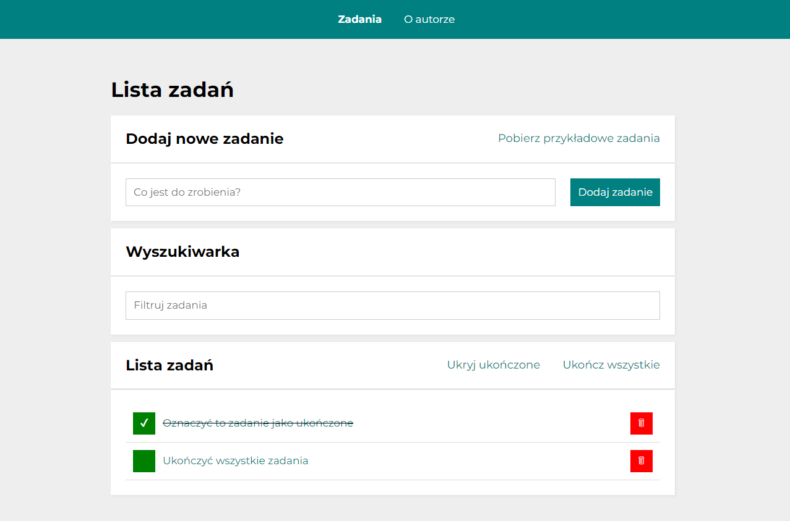

# To-do list

It's a task list where you can add, tick or remove tasks. You can also download sample tasks.

The application uses React Router to switch between the tasks page and the author page. The tasks entered are saved in a localStorage so that the added tasks don't disappear even after the browser is refreshed.

This is the application I created as part of a project for the YouCode Frontend Developer course.

This project was bootstrapped with [Create React App](https://github.com/facebook/create-react-app).

## Preview

## Demo

[Click here](https://krystiangreblowski.github.io/to-do-list-react)

## Technology used

